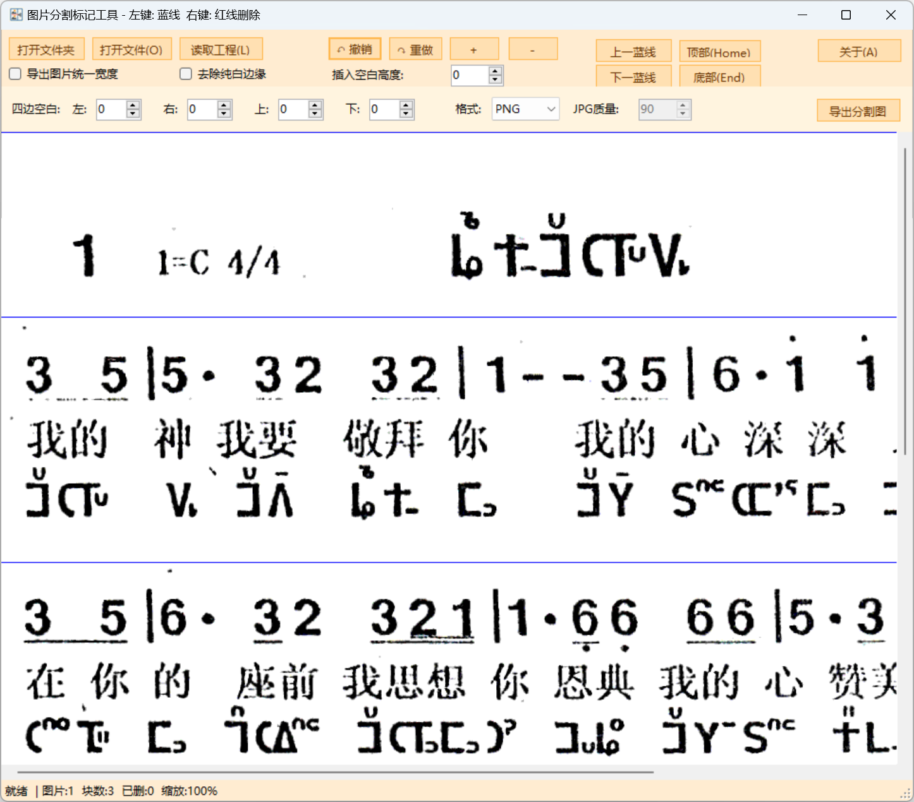
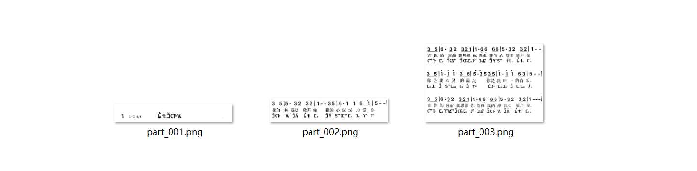

# vbnet_image_splitter

一款基于 VB.NET Windows Forms 的长图分割与标记工具。  
适用于将整页长图（如漫画、教程、条漫、长截图等）按横向分割线切成多张图片，并提供精准的插入空白、删除区域、导出控制、工程保存与恢复等功能。

> 作者: aCr/FTSTT  
> 说明: 使用 AI 协助编程完成的桌面小工具。  
> 官网: https://ftstt.github.io/vbnet_image_splitter/

---

## 功能特性

### 🔗 多图拼接预览

- 支持打开单文件或整文件夹，按**文件名中的数字序号**排序加载。
- 自动按本批次图片的**最大宽度对齐**，较窄的图片左右补白，形成一张**超长可滚动的预览图**。
- 加载失败或图片缺失会提示错误，不会悄悄忽略。

### 📏 可视化分割线标记

- 默认最顶部存在一条蓝色分割线 (Y = 0)，始终保留。
- 鼠标左键单击：在当前 Y 位置添加一条蓝色分割线。
- 鼠标右键单击：以上方最近蓝线为起点，以点击位置为终点，预览红色删除区域并确认删除。
- 鼠标右键拖拽：
  - 选择一段纵向区域；
  - 若选区内存在蓝线，这些蓝线会被**红色粗线包裹高亮**；
  - 确认后删除这些蓝线；选择“否”则恢复原样。
- 分割线在删除区域或插入空白后，其 Y 坐标会自动重新计算，保持逻辑一致。

### ✂ 区域删除与空白插入（可撤销）

- 删除区域：
  - 右键单击，以上方最近蓝线为上边界、点击位置为下边界；
  - 预览区采用红色斜线标记，确认后删除该区域图像内容；
  - 下方内容整体上移，同时更新所有相关分割线坐标。
- 插入空白：
  - 在“插入空白高度”数值框中设置像素高度；
  - 在视图中使用鼠标中键单击，即可在该位置插入一段纯白空白；
  - 下方内容整体下移，所有分割线坐标同步更新。
- 所有删除和插入操作都纳入历史记录，**可以撤销/重做**。

### ↩ 撤销 / 重做（完整工程历史）

- 撤销：按钮“↶ 撤销”或快捷键 `Ctrl + Z`。
- 重做：按钮“↷ 重做”或快捷键 `Ctrl + Y`。
- 内部维护一条完整的动作历史（AddLine / DeleteRegion / InsertBlank 等），
  **不再限制只保留 7 步**，便于工程完整重放。
- 工程保存时会将整个动作序列写入工程文件，加载工程时会从原始图片开始**按顺序重放所有动作**，恢复到保存时的状态。

### 🔍 缩放与导航

- 支持缩放预览长图：
  - 放大：按钮“＋”或 `Ctrl + +`
  - 缩小：按钮“－”或 `Ctrl + -`
- 导航辅助：
  - 上一蓝线：按钮“上一蓝线”或 `Alt + ↑`
  - 下一蓝线：按钮“下一蓝线”或 `Alt + ↓`
  - 跳到顶部：按钮“顶部(Home)”或 `Home`
  - 跳到底部：按钮“底部(End)”或 `End`
- 缩放只影响显示，不改变实际分割坐标。

### 🧰 导出控制（PNG / JPG + Trim + Padding）

- 导出格式：
  - 支持 PNG 与 JPG；
  - 选择 JPG 时可设置 `JPG质量` (10–100) 控制输出质量。
- Trim 纯白边缘：
  - 勾选“去除纯白边缘”时，对每个分块自动检测四边纯白区域并裁掉。
- 四边 Padding：
  - 可对左、右、上、下分别设置额外白边（像素）。
  - 支持与 Trim 联用：先 Trim，再加 Padding。
- 宽度策略：
  - **全局统一宽度**：勾选“全局统一宽度”时，所有分块按本批次最大宽度导出，不足部分补白。
  - **区域最大宽度**：未勾选时，每个分块按其所在区域实际最大宽度导出。

### ⚪ 纯白分块检测

- 导出前对每个分块进行纯白检测。
- 如发现纯白分块，会提示例如：
  - “发现 N 个完全纯白分块，是否一起导出？”
- 用户可选择：
  - 是：包括纯白分块；
  - 否：跳过纯白分块，不生成对应文件。

### 🧱 工程保存与恢复（包含插入空白）

工程文件保存以下状态：

- 图片列表及顺序；
- 所有蓝线位置；
- 所有删除区域操作（DeleteRegion）；
- 所有插入空白操作（InsertBlank），包括插入位置与高度；
- 导出相关选项（Trim、Padding、全局宽度、导出格式、质量、插入空白高度等）；
- 原始拼接高度 (`OriginalHeight`)；
- 当前编辑后高度 (`TotalHeight`)。

加载工程时流程：

1. 按工程中的图片列表重新加载并拼接出长图，记录**当前原始高度**；
2. 对比该高度与工程记录的 `OriginalHeight`：
   - 一致：说明原始图片未被外部修改，继续；
   - 不一致：提示“原始高度与工程记录不一致”，认为工程不匹配，避免错位；
3. 载入导出选项；
4. 依次重放所有历史动作（AddLine / DeleteRegion / InsertBlank），恢复到保存时的完整编辑状态。

> 注意：撤销后的状态会写回工程文件。  
> 如果你在编辑中撤销了若干步再关闭程序，下次通过工程文件打开时，会恢复到**撤销后的状态**，而不是最初操作前的状态。

### 📝 INI 配置记忆

程序会在自身目录生成一个 `.ini` 配置文件，用于记忆：

- 最近使用的导出格式（PNG/JPG）；
- 最近使用的 JPG 质量；
- Trim 选项；
- 四边 Padding 数值；
- 全局统一宽度是否勾选；
- 插入空白高度等。

下次启动程序会自动读取这些配置，作为新工程的默认设置。

### 📊 状态栏信息

状态栏会显示包括但不限于：

- 当前缩放比例；
- 有效分块数量；
- 已删除区域计数；
- 导出统计与异常信息（如某个分块保存失败的提示）等。

---

## 核心使用流程

1. **打开图片**
   - 按钮“打开文件夹”或快捷键 `Ctrl + Shift + O` 选择图片目录；
   - 或按钮“打开文件(&O)” / 快捷键 `Ctrl + O` 选择多个图片；
   - 程序按文件名中的数字部分排序并拼接成长图。

2. **观察与缩放**
   - 使用放大/缩小按钮或快捷键控制缩放；
   - 使用滚动条或导航按钮浏览全图。

3. **添加蓝线**
   - 在需要分割的位置用左键单击；
   - 顶部蓝线 Y=0 始终存在，不会被删除。

4. **删除区域**
   - 右键单击：以最近上方蓝线为起点，以点击位置为终点，预览红色删除区域；
   - 确认后删除该区域，下方内容整体上移。

5. **右键拖拽删除蓝线**
   - 右键按住并拖拽选区；
   - 若有蓝线落在选区内，这些蓝线会被红色粗线包裹高亮；
   - 确认后删除这些蓝线；选择“否”则保持原状。

6. **插入空白**
   - 在“插入空白高度”中设置像素高度；
   - 在图像上中键单击，在当前位置插入对应高度的纯白空白；
   - 插空操作可撤销重做，且会随工程一起保存。

7. **设置导出参数**
   - 根据需要启用 Trim、Padding；
   - 选择全局宽度模式或区域最大宽度模式；
   - 选择导出格式（PNG/JPG）及 JPG 质量。

8. **导出分块**
   - 点击“导出”；
   - 如果检测到纯白分块，会询问是否导出；
   - 如果目标目录存在同名文件，提示是否覆盖；
   - 导出文件命名为 `part_001.ext`, `part_002.ext`, ...

9. **保存与加载工程**
   - 程序在关键操作后自动调用 `SaveProject` 将当前状态写入工程文件；
   - 新工程：首次保存会生成带时间戳的工程文件；
   - 从工程文件打开的工程：将直接保存回原工程路径，不再额外新建工程文件。

---

## 键盘与鼠标操作一览

| 功能           | 快捷键              |
|----------------|---------------------|
| 打开文件夹     | Ctrl + Shift + O    |
| 打开文件       | Ctrl + O            |
| 撤销           | Ctrl + Z            |
| 重做           | Ctrl + Y            |
| 放大           | Ctrl + +            |
| 缩小           | Ctrl + -            |
| 上一蓝线       | Alt + ↑             |
| 下一蓝线       | Alt + ↓             |
| 跳到顶部       | Home                |
| 跳到底部       | End                 |

鼠标操作：

- 左键单击：添加蓝线；
- 右键单击：删除蓝线和当前点之间的图像区域；
- 右键拖拽：选区内蓝线高亮并可批量删除；
- 中键单击：按当前“插入空白高度”插入一段纯白空白。

---

## 构建与运行

### 环境要求

- Windows 10/11
- Visual Studio 2022（推荐）
- .NET Framework 4.x（Windows Forms 项目）

### 构建步骤

1. 克隆仓库：

   ```bash
   git clone https://github.com/FTSTT/vbnet_image_splitter.git
   cd vbnet_image_splitter
   ```

2. 在 Visual Studio 中打开 `.vbproj` 工程文件。

3. 确认启动项目为本工程，目标框架为 .NET Framework 4.x。

4. 编译并运行。

---

## 工程结构（示例）

- `vbnet_image_splitter.vbproj`  
  VB.NET Windows Forms 工程文件。

- `frmSplitter.vb` / `frmSplitter.Designer.vb`  
  主窗体逻辑与 UI 布局。

- `ProjectData.vb`  
  存放 `ProjectData` / `ProjectAction` 等工程数据类，负责工程序列化/反序列化。

- `Module1.vb`  
  入口模块，包含 `Sub Main`。

- `vbnet_image_splitter.ini`  
  配置文件，记忆全局选项。

- `docs/`（推荐目录）  
  存放 README 中引用的截图：
  - `docs/screenshot-main.png`
  - `docs/screenshot-lines.png`
  - `docs/screenshot-export.png`

---

## 截图





## FAQ

### Q: 通过工程打开后再次保存，会不会新建多个工程文件？

A: 不会。  
新工程首次保存会创建一个新的工程文件；  
通过工程文件打开的工程，会记住原工程路径，后续所有保存都覆盖该文件，而不是新建多个工程。

### Q: 删除 / 插空之后工程加载会失败吗？

A: 不会。  
工程会完整保存所有动作，并在加载时重放这些动作，以恢复到当时的编辑状态。  
工程加载失败只会出现在**源图片被修改（尺寸变化）**时，原始高度对比不一致会提示用户工程不匹配。

### Q: 为什么顶部蓝线不能删除？

A: 顶部蓝线 (Y = 0) 作为分块的强制起始边界，保证第一个分块从图像顶部开始，因此不会被删除。

---

## 许可证

Apache-2.0

---

## 致谢

- 作者: aCr/FTSTT  
- 使用 AI 协助完成程序设计与编码。  
- 感谢所有参与需求讨论与测试的用户。
